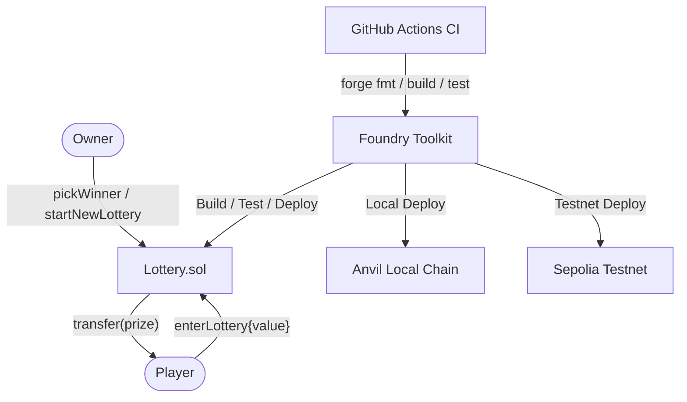

# Lottery

<div align="center">
    
    
    
    
    
</div>

<p align="center">
    <i>A simple, transparent on-chain lottery smart contract built with Foundry. Users purchase fixed-price tickets and a winner is randomly selected to receive the entire prize pool.</i>
</p>

## How It Works

The Lottery contract implements a straightforward raffle system managed by an owner, with full transparency on-chain.

### Lifecycle

```
Deploy (set ticket price)
  └─► Players buy tickets (enterLottery)
        └─► Owner picks winner (pickWinner)
              └─► Prize transferred automatically
                    └─► Owner starts new round (startNewLottery)
```

### Core Functions

| Function            | Access | Description                                        |
| ------------------- | ------ | -------------------------------------------------- |
| `enterLottery()`    | Public | Buy a ticket by sending the exact ticket price     |
| `pickWinner()`      | Owner  | Select a random winner and transfer the prize      |
| `startNewLottery()` | Owner  | Start a new round with a configurable ticket price |
| `getPlayersCount()` | View   | Returns the current number of participants         |
| `getTotalPrize()`   | View   | Returns the accumulated prize pool                 |
| `getPlayers()`      | View   | Returns the full list of current players           |

### Events

| Event            | Emitted When                  |
| ---------------- | ----------------------------- |
| `PlayerEntered`  | A player buys a ticket        |
| `WinnerPicked`   | A winner is selected and paid |
| `LotteryStarted` | A new lottery round begins    |
| `LotteryEnded`   | The current round concludes   |

---

## System Architecture



## Technology Stack

- **Language**: [Solidity](https://soliditylang.org/) ^0.8.19
- **Framework**: [Foundry](https://book.getfoundry.sh/) (Forge, Cast, Anvil)
- **Testing**: Forge Test with fuzz testing support
- **CI/CD**: [GitHub Actions](https://github.com/features/actions) (format, build, test on every push/PR)
- **Standard Library**: [forge-std](https://github.com/foundry-rs/forge-std)

## Key Features

### 1. Fixed-Price Ticket System

- Players enter by sending the exact ticket price in ETH.
- The contract enforces strict price validation — overpayments and underpayments are rejected.
- Multiple players can participate in each round.

### 2. Automated Prize Distribution

- The entire contract balance is transferred to the winner in a single transaction.
- State is reset before the transfer to prevent reentrancy.
- Player array is cleaned up after each round for gas efficiency.

### 3. Multi-Round Support

- After a round ends, the owner can start a new lottery with a different ticket price.
- Each round is independent with its own set of players and prize pool.

### 4. Access Control

- Owner-only functions are protected via a custom `onlyOwner` modifier.
- The lottery state (`active`/`inactive`) is enforced via a `lotteryIsActive` modifier.

### 5. Event-Driven Transparency

- All critical actions emit indexed events for off-chain tracking and frontend integration.
- Events enable building real-time UIs without polling the contract state.

---

## Testing Strategy

The project includes a comprehensive test suite using Forge, covering unit tests, access control, state management, and fuzz testing.

### Test Coverage

#### Unit Tests

- **Constructor validation**: Correct owner, ticket price, and initial state.
- **Ticket purchase**: Single and multiple player entry, price enforcement.
- **Winner selection**: Prize transfer verification, state reset after draw.
- **Round management**: New lottery creation with updated ticket price.

#### Access Control Tests

- **Owner-only enforcement**: Non-owners cannot pick winners or start new rounds.
- **State guards**: Players cannot enter inactive lotteries, owners cannot start a new round while one is active.

#### Event Emission Tests

- Verifies `PlayerEntered`, `WinnerPicked`, and `LotteryStarted` events fire with correct parameters.

#### Fuzz Testing

- `testFuzz_EnterLotteryWithDifferentTicketPrices`: Randomized ticket price inputs (0 < price ≤ 100 ETH) to validate contract behavior across edge cases.

### Security Considerations

- **Reentrancy Protection**: State is updated before external calls (`transfer`).
- **Pseudo-randomness**: Uses `keccak256(block.timestamp, block.difficulty, ...)` — **not suitable for production**. Use [Chainlink VRF](https://docs.chain.link/vrf/v2/introduction) for cryptographically secure randomness.
- **Access Control**: Owner-gated functions prevent unauthorized operations.

Run the full suite with:

```bash
forge test -vvv
```

---

## Gas Analysis

### Deployment Cost

- **Lottery Contract**: ~924,970 gas

### Function Costs

| Function            | Avg Gas | Description                |
| ------------------- | ------- | -------------------------- |
| `enterLottery()`    | ~71,014 | Purchase a ticket          |
| `pickWinner()`      | ~37,203 | Select winner and transfer |
| `startNewLottery()` | ~52,367 | Start a new round          |
| `getPlayersCount()` | ~2,440  | View player count          |
| `getTotalPrize()`   | ~356    | View prize pool            |

### Optimizations Applied

- `payable[]` array for efficient ETH transfers.
- Indexed events for cost-effective log queries.
- View functions for gas-free reads.
- State cleanup after each round to recover storage gas.

---

## Project Setup

### Prerequisites

1. **Git** for version control
2. **Foundry** toolchain (Forge, Cast, Anvil)

### Installation

```bash
# Clone the repository
git clone https://github.com/CallejaJ/lottery-with-foundry.git
cd lottery-with-foundry

# Install Foundry (use Git Bash on Windows)
curl -L https://foundry.paradigm.xyz | bash
source ~/.bashrc
foundryup

# Verify installation
forge --version && cast --version && anvil --version

# Build the project
forge build
```

### Essential Commands

```bash
# Compile contracts
forge build

# Run all tests
forge test -vvv

# Gas report
forge test --gas-report

# Format Solidity code
forge fmt

# Test coverage
forge coverage
```

### Deployment

```bash
# Option 1: Local blockchain (Anvil)
anvil                           # Start local chain in a separate terminal
forge script script/DeployLottery.s.sol \
  --fork-url http://localhost:8545 \
  --broadcast

# Option 2: Sepolia Testnet
forge script script/DeployLottery.s.sol \
  --rpc-url $SEPOLIA_RPC_URL \
  --private-key $PRIVATE_KEY \
  --broadcast \
  --verify \
  --etherscan-api-key $ETHERSCAN_API_KEY
```

---

Built with Foundry for **Lottery**.
