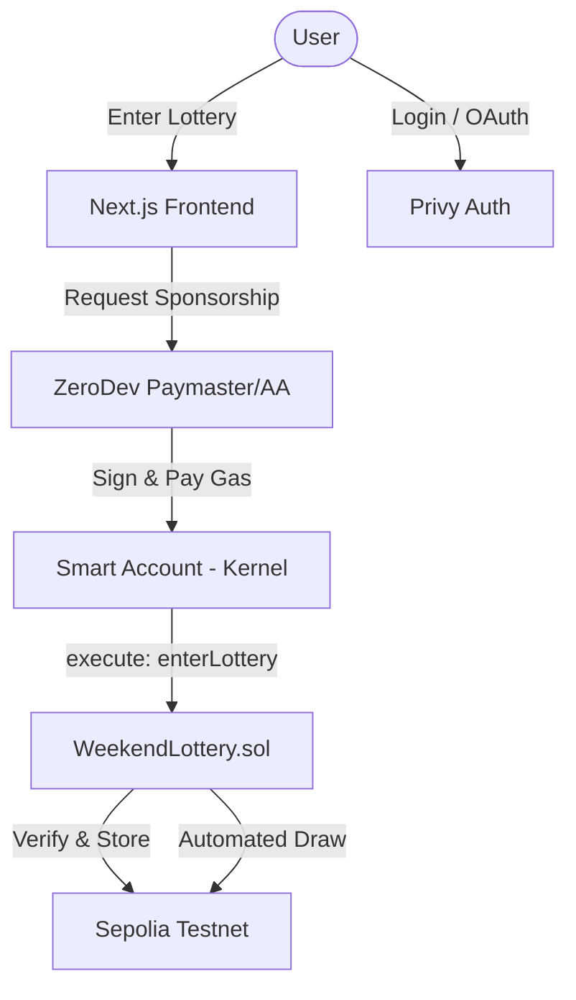

# Sepolia Weekend Lottery

<div align="center">
    
    
    
    
    
</div>

<p align="center">
    <i>A fair, transparent, and <b>gasless</b> on-chain lottery built with Foundry and Next.js. Featuring automated 72h cycles and sponsored entries via Account Abstraction.</i>
</p>

---

## 🚀 How It Works

The Sepolia Weekend Lottery is designed for maximum accessibility and transparency. It leverages **Account Abstraction** to provide a seamless "gasless" experience for users.

### Lifecycle

```
Deploy (set ticket price)
  └─► Users connect via Privy (Social/Wallet)
        └─► Smart Account (Kernel) is generated
              └─► Users enter for FREE (Gas sponsored)
                    └─► Automated Draw every 72h
                          └─► Prize transferred automatically
```

### ⛽ Gasless Entries (Account Abstraction)

We use **ZeroDev (Kernel)** and **Privy** to simplify the Web3 onboarding experience:

- **Social Login**: Enter with just an email—no seed phrase required.
- **Sponsored Transactions**: Gas fees are fully paid by our Paymaster. Users don't need ETH in their wallet to participate.
- **Smart Accounts**: Every user gets a dedicated Smart Account for secure, batchable transactions.

---

## 🏗️ System Architecture



---

## 🛠️ Technology Stack

### Smart Contracts

- **Language**: [Solidity](https://soliditylang.org/) ^0.8.19
- **Framework**: [Foundry](https://book.getfoundry.sh/) (Forge, Cast, Anvil)
- **Deployment**: Sepolia Testnet

### Frontend & AA

- **Framework**: [Next.js 14](https://nextjs.org/) (App Router, TypeScript)
- **Styling**: Tailwind CSS & Lucide Icons
- **Auth**: [Privy](https://www.privy.io/) (Embedded Wallets & Login)
- **Account Abstraction**: [ZeroDev](https://zerodev.app/) (Kernel v2.1)
- **UI Components**: Radix UI (Accordion)

---

## ✨ Features

- **📱 Premium Responsive UI**: A dark, high-end aesthetic inspired by modern Web3 apps.
- **🔗 Linear Header**: Sleek, horizontal navigation with quick-copy Smart Account link.
- **❓ Interactive FAQ**: Explaining pricing models and gas sponsorship in detail.
- **🏦 Automated Cycles**: The contract is designed for 72h automated lottery rounds.
- **🛡️ Security First**: Fuzz testing, access controls, and reentrancy protection.

---

## 🧪 Testing Strategy

The project includes a comprehensive test suite using Forge.

### Core Testing Areas

- **Unit Tests**: Ticket purchase logic, state guards, and access controls.
- **Fuzz Testing**: Validating price enforcement across thousands of randomized inputs.
- **AA Compatibility**: Ensuring contract functions are optimized for smart account calls.

Run tests:

```bash
forge test -vvv
```

---

## 🏁 Getting Started

### Smart Contract Setup

```bash
# Clone
git clone https://github.com/CallejaJ/lottery-with-foundry.git
cd lottery-with-foundry

# Install Foundry
curl -L https://foundry.paradigm.xyz | bash
foundryup

# Build
forge build
```

### Frontend Setup

```bash
cd frontend

# Install dependencies
npm install

# Setup Environment
cp .env.example .env.local
# Add your PRIVY_APP_ID and ZERODEV_PROJECT_ID

# Run Dev Server
npm run dev
```

---

Built with ❤️ for the Web3 Community.
